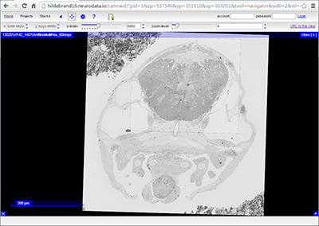
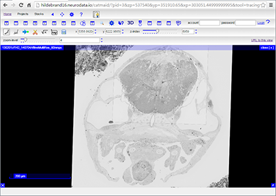

Guide
===================

###Introduction
The goal of this guide is to familiarize users with the Hildebrand16 dataset and the tools used to serve it. The dataset is a collection of serial-section electron microscopy image volumes acquired at different resolutions that collectively encompass the anterior quarter of one 5.5 days post-fertilization larval zebrafish.

We generated this dataset to study the anatomy of the larval zebrafish brain---which is included in its entirety---and peripheral nervous system. Toward this goal, we reconstructed and annotated some features of the nervous system, namely myelinated neuronal processes, which are also available for browsing or analysis. Many non-neuronal tissues are captured in the dataset.

###Software
All electron micrographs and reconstructions are hosted using the [Collaborative Annotation Toolkit for Massive Amounts of Image Data (CATMAID)](http://catmaid.org/). CATMAID is designed to aid in the annotation and sharing of image datasets. This guide serves as an initial reference to help users navigate the CATMAID instance we use to host the dataset. For a more thorough understanding of the software and its functionality, please visit the [CATMAID documentation page](http://catmaid.readthedocs.org/).
Note that using the Google Chrome browser for interacting with CATMAID is highly recommended.

###Getting started
Clicking on either the “[View data](http://hildebrand16.neurodata.io/catmaid/?pid=3&zp=537540&yp=351910&xp=303051&tool=navigator&sid0=2&s0=4)” or the "[View data with reconstructions](http://hildebrand16.neurodata.io/catmaid/?pid=3&zp=537540&yp=351910.65&xp=303051.44999999995&tool=tracingtool&sid0=2&s0=4)" link on the main page will immediately transport you into CATMAID.

| View data     | View data and reconstructions           |
| ------------- |:-------------:|
|       |  |


transverse section of a larval zebrafish. Across the top of the page, you will see the toolbar. Displayed in the toolbar is the current z-index and zoom level. 

####Different resolutions


> **Note:**

> - StackEdit is accessible offline after the application has been loaded for the first time.
> - Your local documents are not shared between different browsers or computers.
> - Clearing your browser's data may **delete all your local documents!** Make sure your documents are synchronized with **Google Drive** or **Dropbox** (check out the [<i class="icon-refresh"></i> Synchronization](#synchronization) section).

#### <i class="icon-file"></i> Create a document

The document panel is accessible using the <i class="icon-folder-open"></i> button in the navigation bar. You can create a new document by clicking <i class="icon-file"></i> **New document** in the document panel.

#### <i class="icon-folder-open"></i> Switch to another document

All your local documents are listed in the document panel. You can switch from one to another by clicking a document in the list or you can toggle documents using <kbd>Ctrl+[</kbd> and <kbd>Ctrl+]</kbd>.

#### <i class="icon-pencil"></i> Rename a document

You can rename the current document by clicking the document title in the navigation bar.

#### <i class="icon-trash"></i> Delete a document

You can delete the current document by clicking <i class="icon-trash"></i> **Delete document** in the document panel.

#### <i class="icon-hdd"></i> Export a document

You can save the current document to a file by clicking <i class="icon-hdd"></i> **Export to disk** from the <i class="icon-provider-stackedit"></i> menu panel.

> **Tip:** Check out the [<i class="icon-upload"></i> Publish a document](#publish-a-document) section for a description of the different output formats.


----------


Markdown Extra
--------------------

StackEdit supports **Markdown Extra**, which extends **Markdown** syntax with some nice features.

> **Tip:** You can disable any **Markdown Extra** feature in the **Extensions** tab of the <i class="icon-cog"></i> **Settings** dialog.

> **Note:** You can find more information about **Markdown** syntax [here][2] and **Markdown Extra** extension [here][3].


### Tables

**Markdown Extra** has a special syntax for tables:

Item     | Value
-------- | ---
Computer | $1600
Phone    | $12
Pipe     | $1

You can specify column alignment with one or two colons:

| Item     | Value | Qty   |
| :------- | ----: | :---: |
| Computer | $1600 |  5    |
| Phone    | $12   |  12   |
| Pipe     | $1    |  234  |


### Definition Lists

**Markdown Extra** has a special syntax for definition lists too:

Term 1
Term 2
:   Definition A
:   Definition B

Term 3

:   Definition C

:   Definition D

	> part of definition D


### Fenced code blocks

GitHub's fenced code blocks are also supported with **Highlight.js** syntax highlighting:

```
// Foo
var bar = 0;
```

> **Tip:** To use **Prettify** instead of **Highlight.js**, just configure the **Markdown Extra** extension in the <i class="icon-cog"></i> **Settings** dialog.

> **Note:** You can find more information:

> - about **Prettify** syntax highlighting [here][5],
> - about **Highlight.js** syntax highlighting [here][6].


### Footnotes

You can create footnotes like this[^footnote].

  [^footnote]: Here is the *text* of the **footnote**.


### SmartyPants

SmartyPants converts ASCII punctuation characters into "smart" typographic punctuation HTML entities. For example:

|                  | ASCII                        | HTML              |
 ----------------- | ---------------------------- | ------------------
| Single backticks | `'Isn't this fun?'`            | 'Isn't this fun?' |
| Quotes           | `"Isn't this fun?"`            | "Isn't this fun?" |
| Dashes           | `-- is en-dash, --- is em-dash` | -- is en-dash, --- is em-dash |


### Table of contents

You can insert a table of contents using the marker `[TOC]`:

[TOC]


### MathJax

You can render *LaTeX* mathematical expressions using **MathJax**, as on [math.stackexchange.com][1]:

The *Gamma function* satisfying $\Gamma(n) = (n-1)!\quad\forall n\in\mathbb N$ is via the Euler integral

$$
\Gamma(z) = \int_0^\infty t^{z-1}e^{-t}dt\,.
$$

> **Tip:** To make sure mathematical expressions are rendered properly on your website, include **MathJax** into your template:

```
<script type="text/javascript" src="https://cdn.mathjax.org/mathjax/latest/MathJax.js?config=TeX-AMS_HTML"></script>
```

> **Note:** You can find more information about **LaTeX** mathematical expressions [here][4].


### UML diagrams

You can also render sequence diagrams like this:

```sequence
Alice->Bob: Hello Bob, how are you?
Note right of Bob: Bob thinks
Bob-->Alice: I am good thanks!
```

And flow charts like this:

```flow
st=>start: Start
e=>end
op=>operation: My Operation
cond=>condition: Yes or No?

st->op->cond
cond(yes)->e
cond(no)->op
```


----------


> **Note:** You can find more information:

> - about **Sequence diagrams** syntax [here][7],
> - about **Flow charts** syntax [here][8].

### Support StackEdit

  [^CATMAID]:  is a full-featured, open-source Markdown editor based on PageDown, the Markdown library used by Stack Overflow and the other Stack Exchange sites.
